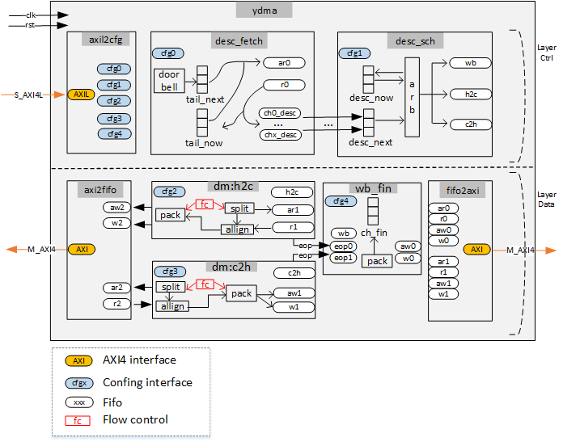

# YDMA

#### Introduction
YDMA (YaoDMA) is a controller used for DMA data transfer, primarily applied between two AXI4 interfaces, such as between a PCIe bridge and an AXI4 memory interface.
Similar to XDMA, YDMA is also a solution for DMA data movement between different buses. However, unlike XDMA, YDMA employs a circular descriptor queue design.
The design of this circular descriptor queue is mainly aimed at addressing the performance issues of XDMA when handling small packets, as well as its shortcomings in real-time performance.
By using a circular buffer to manage descriptors, YDMA can reduce the latency of descriptor processing, improve the transmission efficiency of small packets, and enhance overall real-time performance.
In summary, YDMA is an optimized solution for DMA transfers between AXI4 buses, particularly suitable for applications that need to handle a large number of small packets with high real-time requirements.
YDMA（YaoDMA）是一种用于 DMA 数据传输的控制器,主要应用于两组 AXI4 接口之间,例如 PCIe 桥和 AXI4 内存接口之间。
与 XDMA 类似,YDMA 也是用于在不同总线间进行 DMA 数据搬运的方案。但与 XDMA 不同的是,YDMA 采用了环形描述符队列的设计。
这种环形描述符队列的设计主要是为了解决 XDMA 在处理小数据包时性能不佳,以及实时性较差的问题。
通过使用环形缓冲区来管理描述符,YDMA 可以减少描述符处理的延迟,提高小数据包的传输效率,并增强整体的实时性能。
总之,YDMA 是一种针对 AXI4 总线间 DMA 传输进行优化的解决方案,特别适用于需要处理大量小数据包,且对实时性有较高要求的应用场景。
## Features

#### Logic Arch

## Installation and Usage

## Contributing
logic design: luoyao (luoyao22635@163.com,https://www.zhihu.com/people/luo-yao-88-42)
## License
[text](LICENSE)